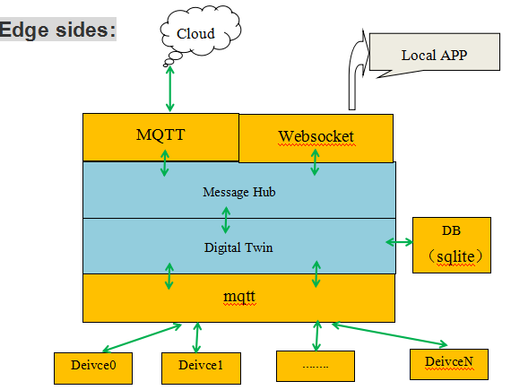

# edgeOn(digital twin on edge)

## What is edgeOn
edgeOn is an open source appliaction framework for edge computing. It's the implementation of the digital twin on edge. each physical device has a digital twin to describe this device on edge, and operate this twin is equal to do this physical device. these twins can be created/updated/deleted/Get/Watch by cloud app or edge app. edgeOn has three parts: cloud part, edge part and device part. edgeOn is either deployed on container environment or non-container environment.

## Introduction

### Architecture
Client

## how to test this program.
 These program will run in same a PC for test. 
### 1. build edge on 
	> $ git clone  https://github.com/jwzl/edgeOn.git
	> $ cd 	edgeOn
	> $ make
	> $ cd  tests  
	> $ go build mqtt_demo.go
	> $ mv mqtt_demo  cloud_dummy_app

### 2. build edgedev (device sides)
	> $ git clone https://github.com/jwzl/edgedev.git
	> $ cd edgedev
	> $ make
### 3. run edgedev application. 
	> $ cd edgedev; ./edgedev
### 4. run edgeon
	> $ cd edgeOn
	> ./tools/certgen.sh
    > # configure the edgeOn/conf/edge.yaml 
	> ./edgeOn

### 5. run the test app dummy cloud app	 (dummy cloud sides)
	> $ cd 	edgeOn/tests
	> $ ./cloud_dummy_app

	Then, you can see the device detailed information in cloud_dummy_app sides.

## Contributing

If you're interested in being a contributor and want to get involved in developing the edgeOn code, please see [CONTRIBUTING](CONTRIBUTING.md) for details on submitting patches and the contribution workflow.
